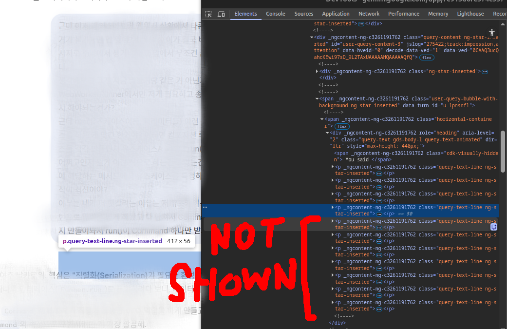

# Gemini Remove User Bubble Max Height



> SHOW FULL USER BUBBLE TEXT THATS HIDDEN EVEN AFTER EXPANDING IT!

Simple chrome extension that shows full user bubble text thats hidden even after expanding it.

Seamlessly works with [Voyager (github.com)](https://github.com/Nagi-ovo/gemini-voyager).

### Notice

This is CSS `max-height` related issue, and user bubble expand/collapse `transition` is applied with `max-height` at gemini page.

> So unfortunately `expand/collapse transition effects are disabled` if you use this.

### Releases

Github

- [v1.0.0](https://github.com/vhv3y8/gemini-remove-userbubble-maxheight/releases/tag/v1.0.0) : [Download Zip](https://github.com/vhv3y8/gemini-remove-userbubble-maxheight/releases/download/v1.0.0/gemini-remove-user-bubble-max-height-1.0.0.zip)

### How to apply

- Download `gemini-remove-user-bubble-max-height-v*.zip` file at releases.
- Open your browser's Extensions page (`chrome://extensions`).
- Enable **Developer mode** (top right).
- Drop extension `.zip` file to the page / or Unzip extension `.zip` file and Click **Load unpacked** to select unzipped folder.

### How to build on your own

Install `pnpm` if you don't have it : [https://pnpm.io/installation](https://pnpm.io/installation)

```bash
pnpm install
pnpm build
```
